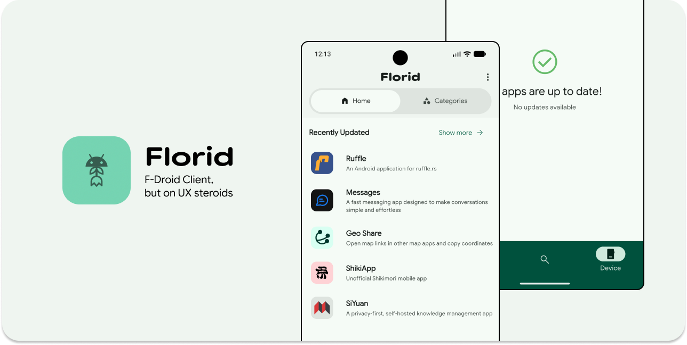

<div align="center">


# Florid — A Modern F‑Droid Client for Android

Browse, search, and install open‑source Android apps from the F‑Droid repository with a clean Material 3 UI. Built with Flutter.

</div>

<div align="center">

[](https://crowdin.com/project/florid) [](https://github.com/Nandanrmenon/florid/actions/workflows/ci.yml)
<a href="https://github.com/Nandanrmenon/florid/releases/latest">

</a>

</div>

## Download

<a href="https://apt.izzysoft.de/packages/com.nahnah.florid">
	 
</a>

## Features

- Latest and trending: Browse recently added and updated apps
- Categories: Explore apps organized by topic
- Powerful search: Instant filtering by name, summary, description, or package
- App details: Rich metadata, versions, permissions, links, and changelogs
- Screenshots: Inline screenshots when available from the repo metadata
- Downloads: Reliable APK downloads with progress and notifications
- Install/uninstall: One‑tap install of downloaded APKs, uninstall via intent
- Updates: Detect newer versions for apps installed on your device
- Appearance: Material 3 design with light/dark and system themes
- Localization: Choose repository content language (e.g., en‑US, de‑DE)
- Offline cache: Fast local database with smart network/cache fallback

## Screenshots

|                                                               |                                                                |                                                               |                                                               |
| :-----------------------------------------------------------: | :------------------------------------------------------------: | :-----------------------------------------------------------: | :-----------------------------------------------------------: |
|  |   |  |  |
|  |   |  |  |
|  |  |                                                               |                                                               |

## Getting Started

### Prerequisites

- Flutter (stable channel)
- Dart SDK >= 3.9.2
- Android SDK + device/emulator (Android 8.0+ recommended)

### Setup

1. Install dependencies

```bash
flutter pub get
```

2. Run on a device

```bash
flutter run
```

First launch performs an initial repository sync and caches data locally for faster subsequent loads and limited offline use.

### Build

Build a release APK:

```bash
flutter build apk --split-per-abi
```

## Contributing

Issues and PRs are welcome! Check out [CONTRIBUTING.md](https://github.com/Nandanrmenon/florid/blob/main/CONTRIBUTING.md) for guidelines.

## Translations

Help translate Florid into other languages at [Crowdin](https://crowdin.com/project/florid).

| Language | Code | Contributors                                                                                                       |
| -------- | ---- | ------------------------------------------------------------------------------------------------------------------ |
| English  | en   | @Nandanrmenon                                                                                                      |
| German   | de   | [@JasmineLowen](https://github.com/JasmineLowen), [@mondlicht-und-sterne](https://github.com/mondlicht-und-sterne) |

## License

GPL‑3.0 - see LICENSE for full text.

## Disclaimer

Florid is an independent project and is not affiliated with or endorsed by F‑Droid. “F‑Droid” is a trademark of its respective owners.
